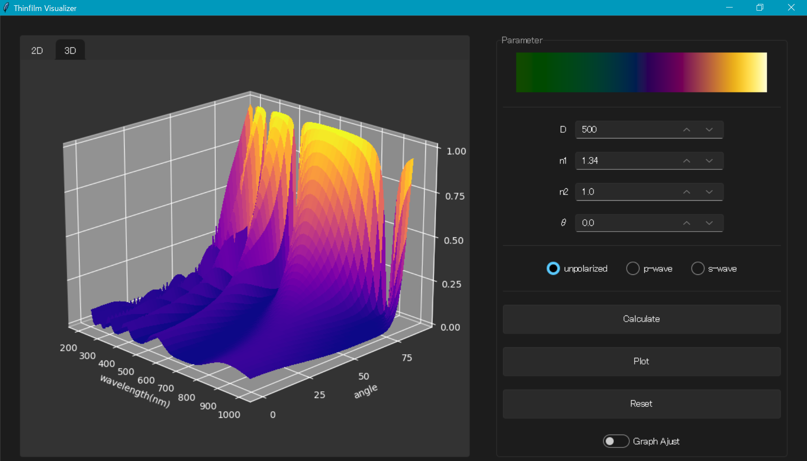

# thinfilm_visualizer

  
  
図1 ユーザインターフェース 

## 概要

`thinfilm_visualizer`はPythonで作成した薄膜干渉可視化ツールです．薄膜干渉とは光の波としての性質により生じる光学現象で，身近ではシャボン玉などで観察されます．
本ツールでは，図1に示す通り，薄膜干渉のスペクトル反射率分布のプロットや光の入射角に応じた色の変化を可視化することができます．

## 開発環境

- Windows10  
- Microsoft Visual Studio 2019 
- Anaconda3

### 言語/フレームワーク

- Python3
- Tkinter

### 外部ライブラリ

- Numpy
- matplotlib
- Pillow
- sv_ttk

## 機能

主に以下の機能を実装しています．

- 薄膜干渉のスペクトル反射率の計算
- スペクトル反射率のRGB反射率への変換
- 偏光ごとの(強度)反射率の表示
- スペクトル反射率の2D/3Dプロット
- 入射角ごとのRGB反射率テーブルの出力

<!-- ## 使い方

使い方

### 使用例

## 原理

### 薄膜干渉

### 分光反射率からRGB反射率への変換

## 参考文献

- [木下 2010] "生物ナノフォトニクス―構造色入門―". 2010.
- [Wyman et al. 2013]. "Simple Analytic Approximations to the CIE XYZ
Color Matching Functions" 2013.
- [Pharr et al. 2016] "Physically Based Rendering: From Theory To Implementation" 2016. -->
