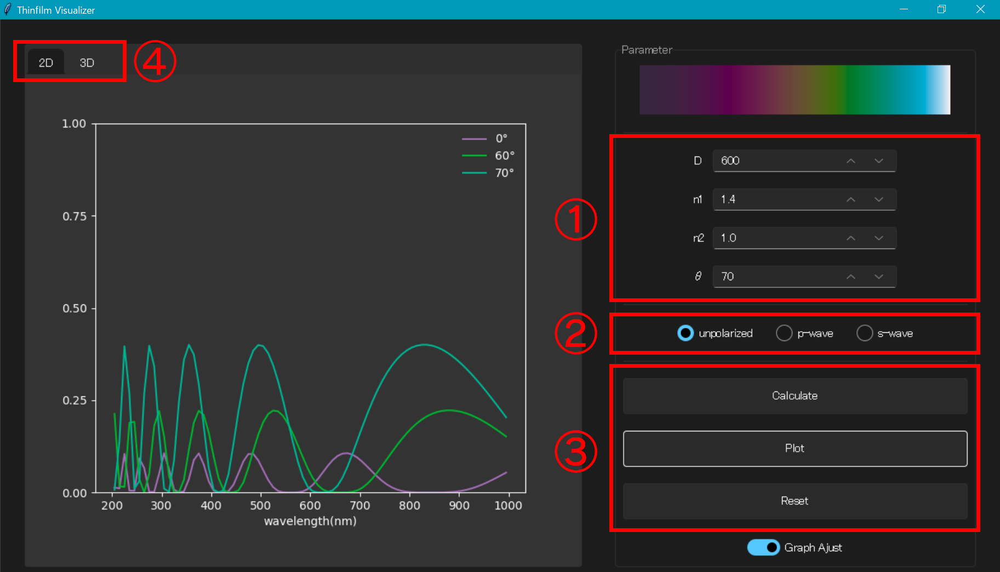

# thinfilm_visualizer

<div align="center">
  
  <p>図1 ユーザインターフェース </p>
</div>

## 概要

`thinfilm_visualizer`はPythonで開発した薄膜干渉可視化ツールです．  
薄膜干渉とは光の波としての性質により生じる光学現象で身近ではシャボン玉などで観察されます．  
本ツールでは，図1に示す通り，薄膜干渉のスペクトル反射率分布(左)や光の入射角に応じた色の変化(右上)を可視化することができます．

## 開発環境

- Windows10  
- Microsoft Visual Studio 2019 
- Anaconda3

### 言語/フレームワーク

- Python3
- Tkinter

### 外部ライブラリ

- [Numpy](https://github.com/numpy/numpy)
- [matplotlib](https://github.com/matplotlib/matplotlib)
- [Pillow](https://github.com/python-pillow/Pillow)
- [sv_ttk](https://github.com/rdbende/Sun-Valley-ttk-theme)

## 機能

主に以下の機能を実装しています．

- 薄膜干渉のスペクトル反射率の計算(偏光対応)
- スペクトル反射率の2Dまたは3Dグラフへのプロット
- スペクトル反射率からRGB反射率への変換
- 干渉色の可視化(強度が一様な光源を仮定)

## 使い方

`src`ディレクトリの`main.py`を実行してください．
実行すると図1や図2のような画面が立ち上がります．

```sl
python main.py
```

<div align="center">
  
  <p>図2 操作方法 </p>
</div>

図2は操作方法の説明です．各番号はそれぞれ次の通りの意味です．

1. 薄膜干渉計算に使用するパラメータ
2. 偏光状態
3. グラフ操作ボタン
4. 2D/3Dプロットの切り替え

(1)のパラメータの意味は次の通りです．

| パラメータ | 説明 |
| --------- | ---- |
| $D$       | 薄膜の膜厚 |
| $n1$      | 薄膜の屈折率 |
| $n2$      | 薄膜がコーティングされる物体の屈折率 |
| $\theta$  | 入射角(2Dプロットで使用) |

(3)のボタンの意味は次の通りです．

| ボタン       | 説明 |
| ----------- | ---- |
| `Calculate` | 指定したパラメータで薄膜干渉の計算を行いグラフにプロットします． |
| `Plot`      | グラフをプロットします．入射角以外のパラメータを変更する場合は`Calculate`ボタンを押して再計算する必要があります． |
| `Reset`     | プロットしたグラフをリセットします． |

**NOTE**  
`Calculate`ボタンを押すと右上に入射角(0°～90°)ごとの薄膜干渉による干渉色(RGB値)を表示します(右に行くほど入射角が大きい)．  
ここで，スペクトルからRGBへの変換には等色関数を利用してします．
等色関数は通常は表形式で与えられますが，本ツールでは[Wyman et al. 2013]の解析的にフィッティングされた等色関数を採用しています．これにより，任意の波長での等色関数の評価が容易になります．さらに，表形式データの保存が不要なためメモリ領域の節約になる場合があります．

## 参考文献

- [木下 2010] "生物ナノフォトニクス―構造色入門―". 2010.
- [Wyman et al. 2013]. "Simple Analytic Approximations to the CIE XYZ
Color Matching Functions" 2013.
- [Pharr et al. 2016] "Physically Based Rendering: From Theory To Implementation" 2016.
